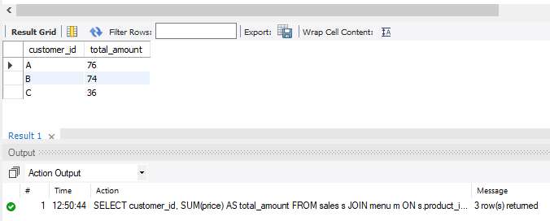
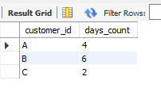
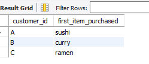
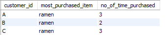
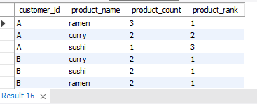
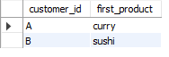
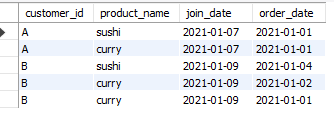
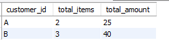
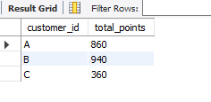
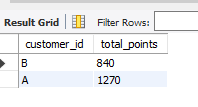

# danny_ma_week1_sql_challenge

To practice my SQL skill, I took Danny MA 8 weeks SQL challenge, case study number 1.
This project gives me the ability to apply my SQL knowlege to provide answers to business questions,
and also derived insight that can help make a better data driven decision.

## Introduction
Danny wants to use data to answer a few simple questions about his customers, especially about their visiting patterns, how much money they’ve spent and also which menu items are their favourite. Having this deeper connection with his customers will help him deliver a better and more personalised experience for his loyal customers.

Danny has provided a sample of his overall customer data due to privacy issues - but he hopes that these examples are enough to write fully functioning SQL queries to help him answer his questions!

Danny has provided 3 key datasets for this case study:
[members](Members.csv)
[menu](Menu.csv)
[sales](Sales.csv)

### Below is the ERD that shows the relationship between the tables

#### I will be using SQL queries to provide answers to danny questions.

## Question 1: What is the total amount each customer spent at the restaurant?
<pre>
SELECT customer_id, 
	SUM(price) AS total_amount
FROM sales S 
JOIN menu M
ON S.product_id = M.product_id 
GROUP BY 1;
</pre>
I joined the menu and sales tables to get customer_id and price, then summed the prices as total_amount and grouped the results by each customer_id.

*_Customers A, B, and C spent $76, $74, and $36 respectively_*

## Question 2: How many days has each customer visited the restaurant?
<pre> 
SELECT customer_id, 
	COUNT( DISTINCT order_date ) AS days_count
FROM sales 
GROUP BY 1;
</pre>
I selected customer_id and counted distinct order_date to capture visits by day (ignoring visit times), then grouped the visit count by each customer_id

*Customer A, B, and C visited the restaurant in 4,6, and 2 days respectively*

## Question 3:  What was the first item from the menu purchased by each customer?
<pre> 
WITH cte AS (
SELECT customer_id, 
	order_date , 
	s.product_id, 
	product_name,
    ROW_NUMBER () OVER ( PARTITION BY customer_id ORDER BY order_date ) AS row_no
FROM sales S
JOIN menu M
ON S.product_id = M.product_id)
SELECT customer_id, 
	product_name AS first_item_purchased
FROM cte
WHERE row_no = 1 ;
</pre>
At first, I create a new table joining sale and menu tables together.
Then, I Assigned a numbering to each customer_id orders as a new column using Row_number window functions.
I made the query result above as CTE and extract each customer_id with their first product ordered(using where row_number = 1).

*The first item purchased by A, B, and C are sushi, curry, and ramen respectively*

## Question 4: What is the most purchased item on the menu and how many times was it purchased by all customers?
<pre>
SELECT S.customer_id, 
	M.product_name AS most_purchased_item, 
	count(S.order_date) AS no_of_time_purchased
FROM sales as S
JOIN menu as M
ON S.product_id = M.product_id
GROUP BY 1,2
HAVING product_name = ( WITH product_no_of_purchase_table AS (
                    SELECT M.product_name, COUNT(product_name) AS total_no_of_purchase
                    FROM sales S JOIN menu M ON S.product_id = M.product_id
                    GROUP BY 1)
      SELECT product_name 
      FROM product_no_of_purchase_table 
      WHERE total_no_of_purchase = (SELECT MAX(total_no_of_purchase) FROM product_no_of_purchase_table) );
</pre>
 Breaking the question down, I need the most purchased item from the menu, and also how many of it each customer bought. 
 
To check for the most purchased item from the menu, I look into all the product and count number of times they are bought with the query below
*SELECT M.product_name, COUNT(product_name) AS total_no_of_purchase
FROM sales S JOIN menu M ON S.product_id = M.product_id
GROUP BY 1*
To pick out the most purchased items from the result, I created a table with the result from the query above using CTE(product_no_of_purchase_table)
Then,I selected only the product_name with max total no of purchase AS most_purchased_product by filtering with the query below
*SELECT product_name FROM cte WHERE total_no_of_purchase = (SELECT MAX(total_no_of_purchase) FROM cte)*
Finally, I counted number of the most_purchased_item bought by each customer using GROUP BY and filtered by product_name with max_no_of_purchased
from the CTE(product_no_of_purchase_table) results

*Most purchased item on the menu was ramen, and customer A,B and C purchased it in 3,2, and 3 times.*

## Question 5: Which item was the most popular for each customer?
<pre>
WITH cte AS (
SELECT DISTINCT customer_id,
	product_name, 
	COUNT(S.product_id) AS product_count
FROM sales S
JOIN menu M
ON S.product_id = M.product_id 
GROUP BY 1,2
ORDER BY 1,3 DESC ) 
SELECT *, DENSE_RANK () OVER ( PARTITION BY customer_id ORDER BY product_count DESC ) AS product_rank
FROM cte ;
</pre>
Assuming that Most popular refer to most bought product by each customer. To do this,Joining sale and menu together,
I created a table showing the customer_id, product_name, and counted each product bought by customer( AS product_count ).
I then create a CTE and add a new column to densely ranked customer product by the number of purchased 
from higher to lower AS product ranked.

*Different products have the same number of purchase for some customers. ramen is the popular product for both customer A and B, 
while ramen, curry and sushi have the same number of purchase for customer C.*

## Question 6: Which item was purchased first by the customer after they became a member?
<pre>
WITH cte AS (
SELECT S.customer_id, 
	product_name, 
	join_date, 
	order_date,
    ROW_NUMBER () OVER ( PARTITION BY customer_id ORDER BY order_date) AS row_no
FROM sales S 
      JOIN menu M
      USING ( product_id )
      LEFT JOIN members ME 
      ON S.customer_id = ME.customer_id
WHERE order_date >= join_date ) 
SELECT customer_id, product_name AS first_product
FROM cte 
WHERE row_no = 1 ;
</pre>
At first, I created a table joining the sale, menu and member together, and add a new column( row_no) using window function
to numbering the customer orders by order_date. Then I selected out customer first product by filtering out customer first order.

*After being a member, curry and sushi was the first item purchased by customer A and customer B respectively. Customer C is not among member, that's why we
  dont have his item among the list obtained.*

## Question 7: Which item was purchased just before the customer became a member?
<pre>
SELECT S.customer_id, 
	product_name, 
	join_date,
	order_date 
FROM sales S
      JOIN menu M
      USING ( product_id ) 
      LEFT JOIN members me 
      ON s.customer_id = me.customer_id 
WHERE order_date < join_date -- to filter customer order before becoming member 
ORDER BY 1;
</pre>

To show product purchased after customer becoming a member, I joined the 3 tables together and
filter customer order before becoming member  using *WHERE order_date < join_date*

*sushi and curry are the items purchased by cutomer A and B before they became member. Note that customer C is not a member.*

## Question 8:  What is the total items and amount spent for each member before they became a member?
<pre>
SELECT S.customer_id,
	COUNT(*) AS total_items,
	SUM(price) AS total_amount
FROM sales S
      JOIN menu M
      USING ( product_id )
      LEFT JOIN members MEM 
      ON s.customer_id = MEM.customer_id 
WHERE order_date < join_date
GROUP BY 1 
ORDER BY 1;
</pre>

Breaking the question, I need to show each customers, their total items, and total amount spent before becoming member.
To do this, I joined the 3 tables together then selected customers, and creating their total items and total amount,filtering only
where the customer order before becaming member.

*Before becoming member, Customer A bought a total of 2 items at total amount of 25, while customer B bought a total of 3 items
at total amount of 40. Note: customer C is not a member.*

## Question 9: If each $1 spent equates to 10 points and sushi has a 2x points multiplier - how many points would each customer have?
<pre>
WITH cte AS (
SELECT customer_id, 
	product_name, 
	price, 
	10*price AS points, 
    CASE 
        WHEN product_name = 'sushi' THEN 2*10*price 
        ELSE 10*price 
    END AS new_points
FROM sales 
      JOIN menu
      USING ( product_id ) )
SELECT customer_id, 
	SUM(new_points) AS total_points
FROM cte
GROUP BY 1;
</pre>

At first, I created a new table by joining the sale and menu table together. This new table involves
customer_id, product_name, price, and two additional columns. A new column named "points" which is equal
to 10 multiply by price( because $1 equals 10points). Also another column named "new_points" using CASE statement.
This was obtained by multiplying the points by 2 if the product_name is sushi and the points remain the same for others.
To obtained total points for each customers, I used CTE(customers_point) for the table created and SUM the new_points( as total_points),
then grouped it by each customer.

*Customer A, B, and C has 860, 940, and 360 points respectively.*

## Question 10: In the first week after a customer joins the program (including their join date) they earn 2x points on all items, not just sushi - how many points do customer A and B have at the end of January?
<pre>
WITH point_table AS(
SELECT s.customer_id,
      product_name,
      join_date,
      order_date,
      price,  
      join_date + INTERVAL 7 DAY AS first_week_after_customer_joins,
	CASE
	      WHEN order_date BETWEEN join_date AND join_date + INTERVAL 7 DAY THEN 2*10*price
        ELSE price*10
	END AS customer_point
FROM sales s
JOIN menu m 
      USING ( product_id )
JOIN members me 
      ON s.customer_id = me.customer_id )
SELECT customer_id,
      SUM(customer_point) AS total_points
FROM point_table
WHERE month(order_date) = 1
GROUP BY 1 ;
</pre>

After merging the sale, member and menu tables together, I created a column(first_week_after_customer_joins) by adding 7 days to the join date column to show date for a week after customer joined. Also to give the 2x point on all items, I created another column using CASE statement. This was done by assigning 2*10*price to the orders made 
BETWEEN join_date AND the new created "first_week_after_customer_joins" and leaving the price if the condition was not met.
Finally, to answer the question, I created a CTE(point_table) including customer_id, product_name, join_date, order_date, price, and the
2 new columns(first_week_after_customer_joins and customer_point), then SUMming the customer_points by customer_id, This was done for
orders only in the month of january (WHERE month(order_date) = 1)

*Customer A has 1270 points while customer B has 840 points*

